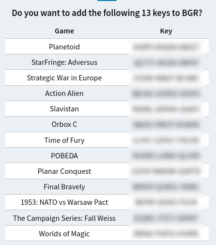

The script was written primarily for myself, but by request was placed in the public. Ideas and prs are welcome :)

# Versions
There three versions of this scripts:
- For Windows
- For Unix-like systems
- For Python

If you want to use this script on any of your systems you can use Python version
Either you can use native version for your system

# Installation
Script doesn't require any specific software besides Python version, which requires Python 3.* installed.
Just download script and run.

# Using
## Windows
1. Download **extract_keys.bat**
2. Open CMD and run
```
extract_keys.bat input1.txt input2.txt input3.txt
```
in same directory with script

## Unix-like
1. Download **extract_keys.sh**
2. Open terminal and give launch permission to script:
```
chmod +x extract_keys.sh
```
Then launch script:
```
./extract_keys.sh input1.txt input2.txt input3.txt
```

## Python
1. First, install Python. Installation may vary from system
2. Download **extract_keys.py**
3. Then, in terminal run:
```
python extract_keys.py input1.txt input2.txt input3.txt
```

In all this cases output file will be placed in the same directory with script, file will be named ```extracted_keys.txt```

# Example
Let's imagine that you have a file with keys, but in addition to the keys, it has extra text.
Script extracting all keys from input file in the next format:

Example file:
```
========================== Product  #21703391 House of Detention (18+) | Quantity: 1 ==========================
XXXX-XXXX-XXXX
========================== End of Product #21703406==========================

========================== Product  #21703391 Defense of Egypt: Cleopatra Mission | Quantity: 1 ==========================
AAAA-BBBB-CCCC
========================== End of Product #21703405==========================

========================== Product  #21703391 Neighboring Islands | Quantity: 1 ==========================
DDDD-EEEE-FFFF
========================== End of Product #21703404==========================
```

And after executing of script we get this:
```
XXXX-XXXX-XXXX
AAAA-BBBB-CCCC
DDDD-EEEE-FFFF
```


# Additional info
There is support for services like https://cheapkeys.ovh/table.php.
For parsing game names with keys like ```AAAA-BBBB-CCCC GAME-NAME``` just add -n (or --game-name) flag to script.


**Warning**, use this flag only for this service or it's likely to crash script

The script is ideal for bulk key activation via [ASF](https://github.com/JustArchiNET/ArchiSteamFarm).
